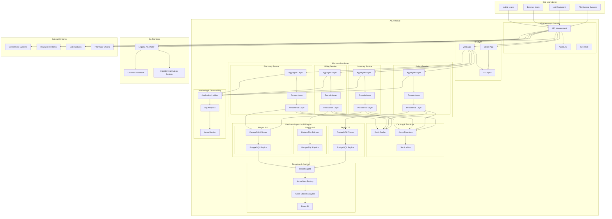

# Hospital System Modernization - Architecture Diagrams

## Reference Architecture

```mermaid
graph TB
    subgraph "End Users Layer"
        MU[Mobile Users]
        BU[Browser Users]
        LE[Lab Equipment]
        FS[File Storage Systems]
    end
    
    subgraph "Azure Cloud"
        subgraph "API Gateway & Security"
            APIM[API Management]
            AAD[Azure AD]
            KV[Key Vault]
        end
        
        subgraph "UI Layer"
            WA[Web App]
            MA[Mobile App]
            AI[AI Copilot]
        end
        
        subgraph "Microservices Layer"
            subgraph "Pharmacy Service"
                PA[Aggregate Layer]
                PD[Domain Layer]
                PP[Persistence Layer]
            end
            
            subgraph "Billing Service"
                BA[Aggregate Layer]
                BD[Domain Layer]
                BP[Persistence Layer]
            end
            
            subgraph "Patient Service"
                PTA[Aggregate Layer]
                PTD[Domain Layer]
                PTP[Persistence Layer]
            end
            
            subgraph "Inventory Service"
                IA[Aggregate Layer]
                ID[Domain Layer]
                IP[Persistence Layer]
            end
        end
        
        subgraph "Caching & Functions"
            RC[Redis Cache]
            AF[Azure Functions]
            SB[Service Bus]
        end
        
        subgraph "Database Layer - Multi-Region"
            subgraph "Region 1-3"
                PG1[PostgreSQL Primary]
                PG1R[PostgreSQL Replica]
            end
            
            subgraph "Region 4-6"
                PG2[PostgreSQL Primary]
                PG2R[PostgreSQL Replica]
            end
            
            subgraph "Region 7-9"
                PG3[PostgreSQL Primary]
                PG3R[PostgreSQL Replica]
            end
        end
        
        subgraph "Reporting & Analytics"
            RDB[Reporting DB]
            PBI[Power BI]
            ADF[Azure Data Factory]
            ASA[Azure Stream Analytics]
        end
        
        subgraph "Monitoring & Observability"
            AI_INSIGHTS[Application Insights]
            LA[Log Analytics]
            AM[Azure Monitor]
        end
    end
    
    subgraph "On-Premises"
        LEGACY[Legacy .NET/WCF]
        ONPREM_DB[On-Prem Database]
        HIS[Hospital Information System]
    end
    
    subgraph "External Systems"
        GOVT[Government Systems]
        INS[Insurance Systems]
        LAB[External Labs]
        PHARMA[Pharmacy Chains]
    end
    
    MU --> APIM
    BU --> APIM
    LE --> APIM
    FS --> APIM
    
    APIM --> AAD
    APIM --> WA
    APIM --> MA
    
    WA --> AI
    MA --> AI
    
    WA --> PA
    WA --> BA
    WA --> PTA
    WA --> IA
    
    PA --> PD --> PP
    BA --> BD --> BP
    PTA --> PTD --> PTP
    IA --> ID --> IP
    
    PP --> RC
    BP --> RC
    PTP --> RC
    IP --> RC
    
    PP --> AF
    BP --> AF
    PTP --> AF
    IP --> AF
    
    AF --> SB
    
    PP --> PG1
    BP --> PG2
    PTP --> PG3
    IP --> PG1
    
    PG1 --> PG1R
    PG2 --> PG2R
    PG3 --> PG3R
    
    PG1R --> RDB
    PG2R --> RDB
    PG3R --> RDB
    
    RDB --> ADF
    ADF --> ASA
    ASA --> PBI
    
    APIM --> LEGACY
    LEGACY --> ONPREM_DB
    LEGACY --> HIS
    
    APIM --> GOVT
    APIM --> INS
    APIM --> LAB
    APIM --> PHARMA
    
    PA --> AI_INSIGHTS
    BA --> AI_INSIGHTS
    PTA --> AI_INSIGHTS
    IA --> AI_INSIGHTS
    
    AI_INSIGHTS --> LA
    LA --> AM
```

## Logical Architecture

```mermaid
graph TB
    subgraph "Presentation Tier"
        subgraph "User Interfaces"
            PWA[Progressive Web App]
            MOBILE[Native Mobile Apps]
            PORTAL[Admin Portal]
        end
        
        subgraph "AI Integration"
            CHATBOT[AI Chatbot]
            VOICE[Voice Assistant]
            PREDICT[Predictive Analytics]
        end
    end
    
    subgraph "API Gateway Tier"
        subgraph "Security & Routing"
            GATEWAY[API Gateway]
            AUTH[Authentication Service]
            AUTHZ[Authorization Service]
            RATE[Rate Limiting]
        end
    end
    
    subgraph "Business Logic Tier"
        subgraph "Core Microservices"
            PATIENT[Patient Management]
            PHARMACY[Pharmacy Management]
            BILLING[Billing & Finance]
            INVENTORY[Inventory Management]
            APPOINTMENT[Appointment Scheduling]
            EMR[Electronic Medical Records]
            LAB_SVC[Laboratory Services]
            RADIOLOGY[Radiology Services]
        end
        
        subgraph "Cross-Cutting Services"
            NOTIFICATION[Notification Service]
            AUDIT[Audit Service]
            CONFIG[Configuration Service]
            WORKFLOW[Workflow Engine]
        end
    end
    
    subgraph "Integration Tier"
        subgraph "Message Broker"
            EVENT_BUS[Event Bus]
            QUEUE[Message Queue]
        end
        
        subgraph "Adapters"
            LEGACY_ADAPTER[Legacy System Adapter]
            EXT_ADAPTER[External System Adapter]
            DEVICE_ADAPTER[Medical Device Adapter]
        end
    end
    
    subgraph "Data Tier"
        subgraph "Operational Databases"
            PATIENT_DB[(Patient DB)]
            PHARMACY_DB[(Pharmacy DB)]
            BILLING_DB[(Billing DB)]
            INVENTORY_DB[(Inventory DB)]
            EMR_DB[(EMR DB)]
        end
        
        subgraph "Analytical Databases"
            DW[(Data Warehouse)]
            OLAP[(OLAP Cubes)]
            LAKE[Data Lake]
        end
        
        subgraph "Caching Layer"
            REDIS[Redis Cluster]
            CDN[Content Delivery Network]
        end
    end
    
    subgraph "Infrastructure Tier"
        subgraph "Compute"
            CONTAINERS[Container Orchestration]
            SERVERLESS[Serverless Functions]
            VM[Virtual Machines]
        end
        
        subgraph "Storage"
            BLOB[Blob Storage]
            FILE[File Storage]
            BACKUP[Backup Storage]
        end
        
        subgraph "Networking"
            VNET[Virtual Network]
            LB[Load Balancer]
            FIREWALL[Web Application Firewall]
        end
    end
    
    subgraph "Monitoring & Operations"
        LOGGING[Centralized Logging]
        METRICS[Metrics Collection]
        ALERTING[Alerting System]
        DASHBOARD[Operations Dashboard]
    end
    
    PWA --> GATEWAY
    MOBILE --> GATEWAY
    PORTAL --> GATEWAY
    
    GATEWAY --> AUTH
    GATEWAY --> AUTHZ
    GATEWAY --> RATE
    
    GATEWAY --> PATIENT
    GATEWAY --> PHARMACY
    GATEWAY --> BILLING
    GATEWAY --> INVENTORY
    GATEWAY --> APPOINTMENT
    GATEWAY --> EMR
    GATEWAY --> LAB_SVC
    GATEWAY --> RADIOLOGY
    
    PATIENT --> NOTIFICATION
    PHARMACY --> AUDIT
    BILLING --> CONFIG
    INVENTORY --> WORKFLOW
    
    PATIENT --> EVENT_BUS
    PHARMACY --> EVENT_BUS
    BILLING --> EVENT_BUS
    INVENTORY --> EVENT_BUS
    
    EVENT_BUS --> QUEUE
    
    LEGACY_ADAPTER --> EVENT_BUS
    EXT_ADAPTER --> EVENT_BUS
    DEVICE_ADAPTER --> EVENT_BUS
    
    PATIENT --> PATIENT_DB
    PHARMACY --> PHARMACY_DB
    BILLING --> BILLING_DB
    INVENTORY --> INVENTORY_DB
    EMR --> EMR_DB
    
    PATIENT_DB --> DW
    PHARMACY_DB --> DW
    BILLING_DB --> DW
    
    DW --> OLAP
    DW --> LAKE
    
    PATIENT --> REDIS
    PHARMACY --> REDIS
    BILLING --> REDIS
    
    CONTAINERS --> PATIENT
    CONTAINERS --> PHARMACY
    CONTAINERS --> BILLING
    
    SERVERLESS --> NOTIFICATION
    SERVERLESS --> AUDIT
    
    PATIENT_DB --> BLOB
    EMR_DB --> FILE
    
    GATEWAY --> LB
    LB --> FIREWALL
    
    PATIENT --> LOGGING
    PHARMACY --> METRICS
    BILLING --> ALERTING
    
    LOGGING --> DASHBOARD
    METRICS --> DASHBOARD
    ALERTING --> DASHBOARD
```