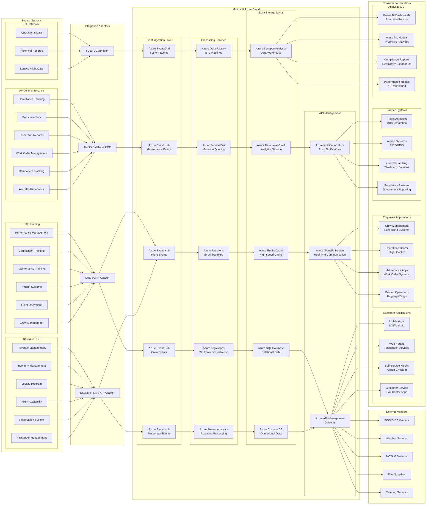
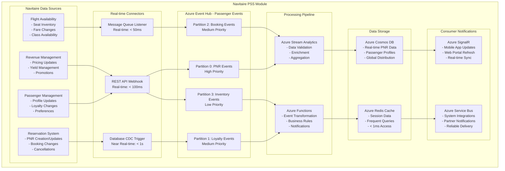
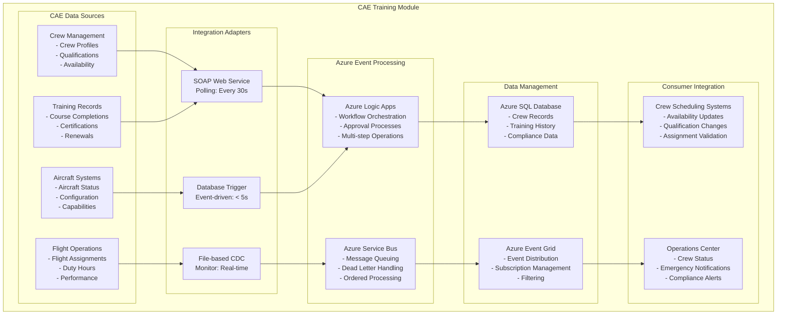
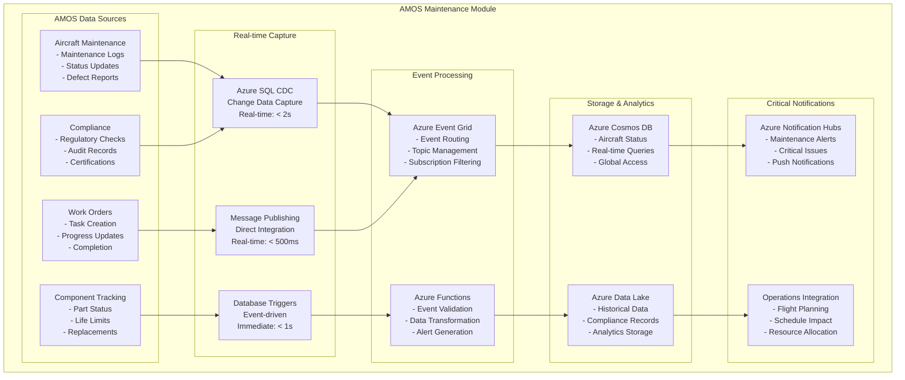
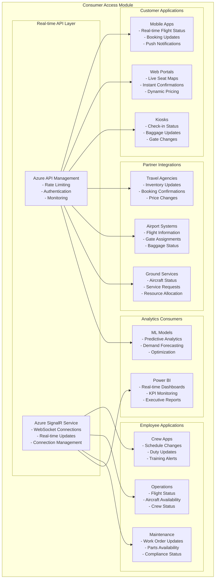

# Comprehensive Airline Event Platform - Microsoft Azure Architecture Diagram

## Complete System Architecture with Real-time Ingestion and Retrieval



## Detailed Module Architecture Diagrams

### 1. Navitaire PSS Real-time Integration Module



### 2. CAE Training System Real-time Integration Module



### 3. AMOS Maintenance System Real-time Integration Module



### 4. Consumer Applications Real-time Access Module



## Real-time Data Flow Specifications

### Performance Metrics by Module

| Module | Data Volume | Latency Target | Throughput | Availability |
|--------|-------------|----------------|------------|--------------|
| Navitaire PSS | 50K events/hour | < 100ms | 1000 TPS | 99.99% |
| CAE Training | 2K events/hour | < 5 minutes | 100 TPS | 99.9% |
| AMOS Maintenance | 5K events/hour | < 30 seconds | 200 TPS | 99.95% |
| Consumer APIs | 100K requests/hour | < 50ms | 2000 TPS | 99.99% |

### Event Types and Priorities

#### High Priority Events (< 100ms)
- PNR Creation/Modification
- Flight Status Changes
- Aircraft Grounding
- Critical Maintenance Alerts
- Crew Emergency Changes

#### Medium Priority Events (< 1 second)
- Inventory Updates
- Loyalty Point Changes
- Training Completions
- Work Order Updates
- Schedule Modifications

#### Low Priority Events (< 5 minutes)
- Historical Data Sync
- Compliance Reports
- Analytics Updates
- Batch Notifications
- Archive Operations

## Microsoft Azure Services Configuration

### Event Hub Configuration
```json
{
  "namespace": "airline-events-production",
  "location": "East US",
  "sku": "Standard",
  "throughputUnits": 40,
  "autoInflateEnabled": true,
  "maximumThroughputUnits": 100,
  "eventHubs": [
    {
      "name": "passenger-events",
      "partitionCount": 8,
      "messageRetentionInDays": 7,
      "captureEnabled": true
    },
    {
      "name": "flight-events", 
      "partitionCount": 6,
      "messageRetentionInDays": 7
    },
    {
      "name": "crew-events",
      "partitionCount": 4,
      "messageRetentionInDays": 7
    },
    {
      "name": "maintenance-events",
      "partitionCount": 4,
      "messageRetentionInDays": 7
    }
  ]
}
```

### Stream Analytics Jobs
```json
{
  "jobs": [
    {
      "name": "passenger-real-time-processor",
      "streamingUnits": 6,
      "inputs": ["passenger-events"],
      "outputs": ["cosmos-db", "signalr-service"],
      "query": "SELECT * INTO [cosmos-db] FROM [passenger-events] WHERE Priority = 'High'"
    },
    {
      "name": "flight-operations-processor", 
      "streamingUnits": 4,
      "inputs": ["flight-events", "crew-events"],
      "outputs": ["sql-database", "notification-hubs"]
    }
  ]
}
```

This comprehensive architecture diagram shows all modules with real-time ingestion and retrieval capabilities, emphasizing Microsoft Azure services throughout the entire data flow from source systems to consumer applications.
