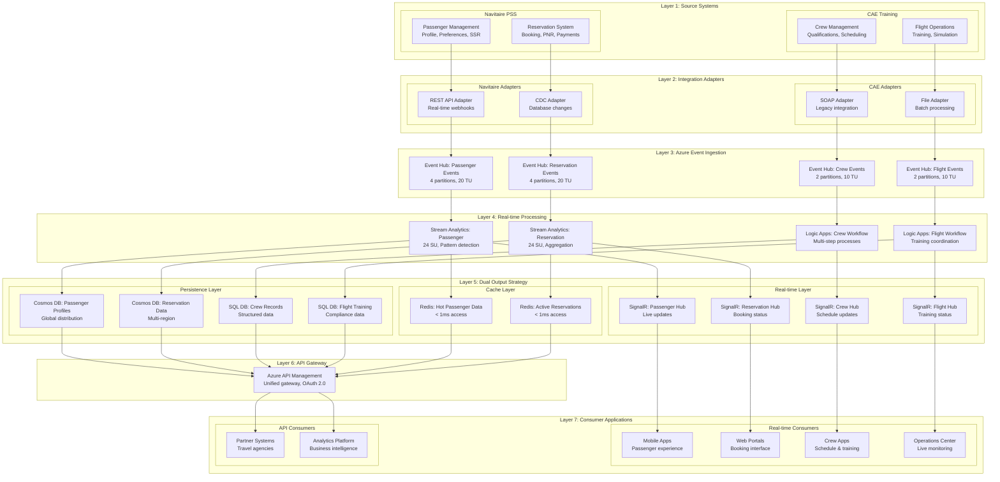
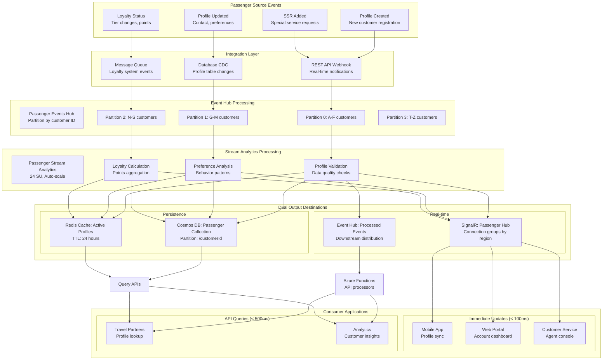
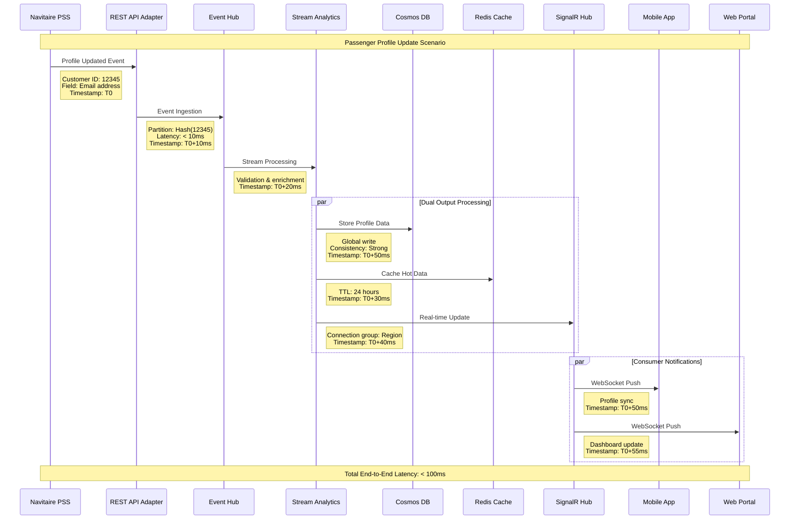
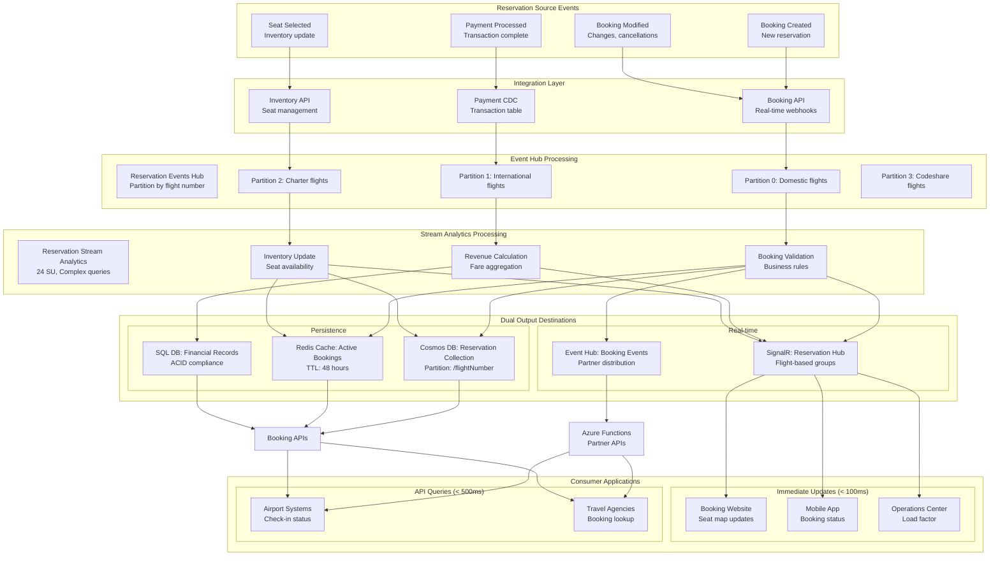
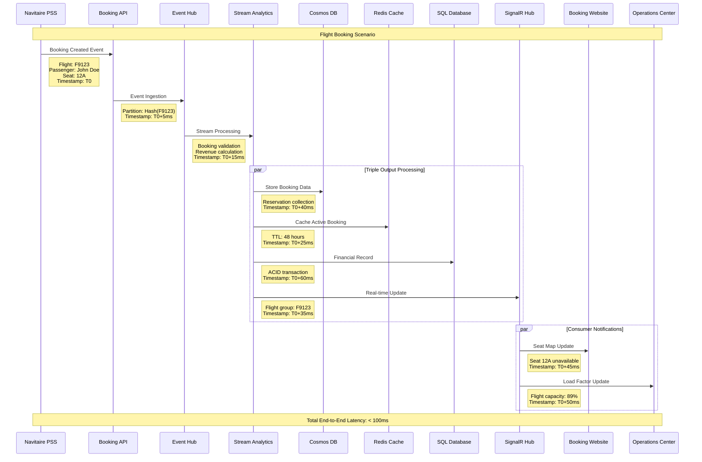
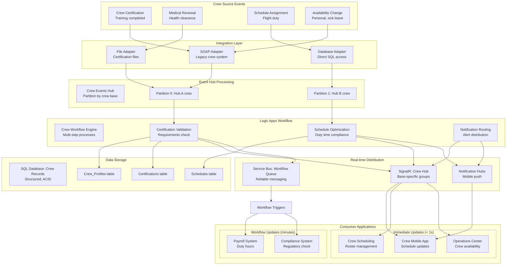
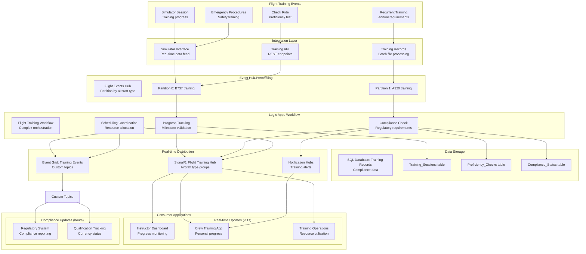
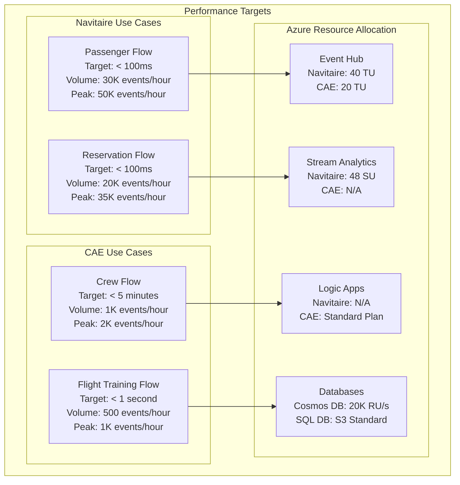
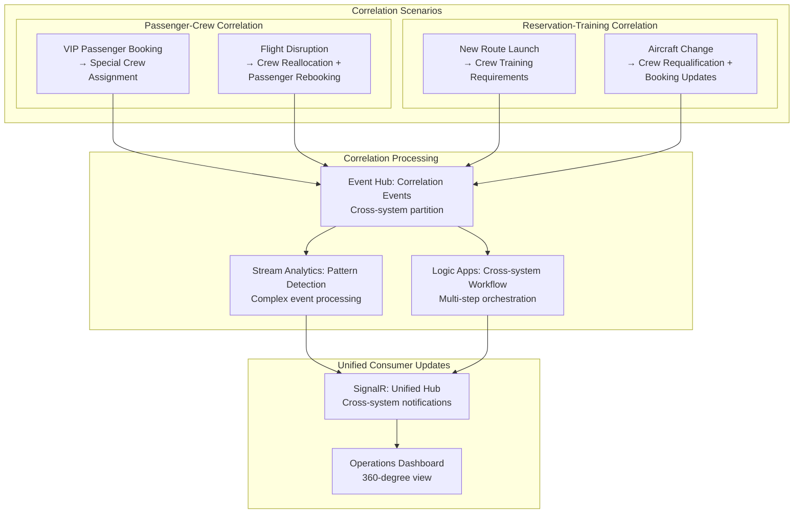

# Horizontal Layered Architecture - 4 Use Cases
## Navitaire: Passenger & Reservation | CAE: Crew & Flight

## Overall Horizontal Layered Architecture



## Use Case 1: Navitaire Passenger Flow

### Passenger Profile Management Data Flow


### Passenger Event Processing Sequence


## Use Case 2: Navitaire Reservation Flow

### Reservation Booking Data Flow


### Reservation Booking Sequence


## Use Case 3: CAE Crew Flow

### Crew Management Data Flow


### Crew Certification Sequence
```mermaid
sequenceDiagram
    participant C as CAE Training
    participant SOAP as SOAP Adapter
    participant EH as Event Hub
    participant LA as Logic Apps
    participant SQL as SQL Database
    participant SR as SignalR Hub
    participant SB as Service Bus
    participant CREW as Crew App
    participant SCHED as Crew Scheduling
    
    Note over C,SCHED: Crew Certification Scenario
    
    C->>SOAP: Training Completed
    Note right of C: Crew ID: 5678<br/>Course: B737 Type Rating<br/>Score: 95%<br/>Timestamp: T0
    
    SOAP->>EH: Event Ingestion
    Note right of SOAP: Crew base partition<br/>Timestamp: T0+30s
    
    EH->>LA: Workflow Trigger
    Note right of EH: Certification workflow<br/>Timestamp: T0+45s
    
    LA->>LA: Validation Process
    Note right of LA: Check prerequisites<br/>Medical validity<br/>Experience requirements<br/>Duration: 2-5 minutes
    
    par Workflow Completion
        LA->>SQL: Update Certification
        Note right of LA: Crew_Certifications table<br/>Active status<br/>Timestamp: T0+5min
        
        LA->>SR: Real-time Notification
        Note right of LA: Crew hub group<br/>Timestamp: T0+5min
        
        LA->>SB: Workflow Queue
        Note right of LA: Downstream processes<br/>Timestamp: T0+5min
    end
    
    par Consumer Updates
        SR->>CREW: Certification Alert
        Note right of SR: Mobile notification<br/>New qualification<br/>Timestamp: T0+5min
        
        SR->>SCHED: Crew Available
        Note right of SR: Scheduling update<br/>B737 qualified<br/>Timestamp: T0+5min
    end
    
    SB->>PAYROLL1[Payroll System]
    Note right of SB: Qualification pay<br/>Effective date<br/>Timestamp: T0+10min
    
    Note over C,SCHED: Total Process Time: 5-10 minutes<br/>Real-time notifications: < 1 second
```

## Use Case 4: CAE Flight Flow

### Flight Training Data Flow


### Flight Training Sequence
```mermaid
sequenceDiagram
    participant C as CAE Simulator
    participant SIM as Simulator Interface
    participant EH as Event Hub
    participant LA as Logic Apps
    participant SQL as SQL Database
    participant SR as SignalR Hub
    participant EG as Event Grid
    participant INST as Instructor Dashboard
    participant CREW as Crew App
    
    Note over C,CREW: Simulator Training Session
    
    C->>SIM: Session Started
    Note right of C: Crew ID: 5678<br/>Aircraft: B737-800<br/>Scenario: Emergency Landing<br/>Timestamp: T0
    
    SIM->>EH: Real-time Data Feed
    Note right of SIM: Performance metrics<br/>Every 30 seconds<br/>Timestamp: T0 to T0+2hrs
    
    loop Training Session (2 hours)
        EH->>LA: Progress Update
        Note right of EH: Performance data<br/>Milestone tracking
        
        LA->>SQL: Store Session Data
        Note right of LA: Training_Sessions table<br/>Real-time updates
        
        LA->>SR: Live Progress
        Note right of LA: Instructor monitoring<br/>< 1 second latency
        
        SR->>INST: Dashboard Update
        Note right of SR: Performance graphs<br/>Real-time metrics
    end
    
    C->>SIM: Session Completed
    Note right of C: Final score: 88%<br/>Status: Passed<br/>Timestamp: T0+2hrs
    
    SIM->>EH: Final Results
    Note right of SIM: Complete session data<br/>Timestamp: T0+2hrs
    
    EH->>LA: Completion Workflow
    Note right of EH: Final processing<br/>Timestamp: T0+2hrs+30s
    
    par Completion Processing
        LA->>SQL: Final Record
        Note right of LA: Proficiency_Checks table<br/>Certification update<br/>Timestamp: T0+2hrs+1min
        
        LA->>SR: Completion Alert
        Note right of LA: Training complete<br/>Timestamp: T0+2hrs+45s
        
        LA->>EG: Compliance Event
        Note right of LA: Regulatory notification<br/>Timestamp: T0+2hrs+1min
    end
    
    par Consumer Notifications
        SR->>CREW: Training Complete
        Note right of SR: Mobile notification<br/>Certificate available<br/>Timestamp: T0+2hrs+1min
        
        EG->>REG1[Regulatory System]
        Note right of EG: Compliance update<br/>Training record<br/>Timestamp: T0+2hrs+2min
    end
    
    Note over C,CREW: Session Duration: 2 hours<br/>Real-time updates: < 1 second<br/>Final processing: < 2 minutes
```

## Performance Specifications by Use Case

### Latency and Throughput Matrix


## Cross-Use Case Integration Points

### Inter-System Event Correlation

