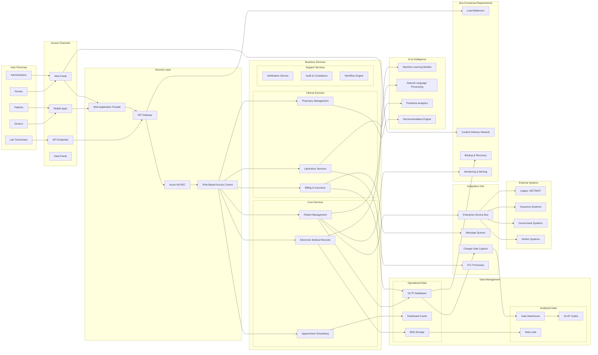

# Hospital System Modernization - Architecture Diagrams

## Reference Architecture

```mermaid
graph TB
    %% End Users Layer
    subgraph "End Users Layer"
        MU[Mobile Users]
        BU[Browser Users]
        LE[Lab Equipment]
        FS[File Storage Systems]
    end

    %% API Gateway & Auth
    subgraph "Gateway & Authentication"
        AG[API Gateway]
        AAD[Azure AD]
        AG --> AAD
    end

    %% UI Layer
    subgraph "UI Layer with AI"
        WEB[Web Application]
        MOB[Mobile App]
        AI[AI Assistant/Chatbot]
        DASH[Analytics Dashboard]
    end

    %% Microservices Layer
    subgraph "Microservices Layer"
        subgraph "Pharmacy Service"
            PS_AGG[Aggregate Layer]
            PS_DOM[Domain Layer]
            PS_PER[Persistence Layer]
        end
        
        subgraph "Billing Service"
            BS_AGG[Aggregate Layer]
            BS_DOM[Domain Layer]
            BS_PER[Persistence Layer]
        end
        
        subgraph "Patient Service"
            PT_AGG[Aggregate Layer]
            PT_DOM[Domain Layer]
            PT_PER[Persistence Layer]
        end
        
        subgraph "Appointment Service"
            AP_AGG[Aggregate Layer]
            AP_DOM[Domain Layer]
            AP_PER[Persistence Layer]
        end
        
        subgraph "Lab Service"
            LS_AGG[Aggregate Layer]
            LS_DOM[Domain Layer]
            LS_PER[Persistence Layer]
        end
    end

    %% Caching & Functions
    subgraph "Caching & Serverless"
        REDIS[Redis Cache]
        AF[Azure Functions]
    end

    %% Database Layer
    subgraph "Multi-Region Database"
        subgraph "Region 1 - Primary"
            DB1[PostgreSQL Primary]
        end
        subgraph "Region 2-9 - Replicas"
            DB2[PostgreSQL Replica 2]
            DB3[PostgreSQL Replica 3]
            DB9[PostgreSQL Replica 9]
        end
        DB1 -.->|Replication| DB2
        DB1 -.->|Replication| DB3
        DB1 -.->|Replication| DB9
    end

    %% Reporting
    subgraph "Reporting Layer"
        RPT[Reporting Service]
        RPTDB[Reporting Database]
        RPT --> RPTDB
    end

    %% Integration Layer
    subgraph "Integration Layer"
        ONPREM[On-Premise Integration]
        EXT[External Integrations]
        ESB[Enterprise Service Bus]
    end

    %% Monitoring & Analytics
    subgraph "Monitoring & Analytics"
        MON[Application Insights]
        LOG[Log Analytics]
        ALERT[Alert Manager]
    end

    %% Connections
    MU --> AG
    BU --> AG
    LE --> AG
    FS --> AG
    
    AG --> WEB
    AG --> MOB
    AG --> AI
    
    WEB --> PS_AGG
    WEB --> BS_AGG
    WEB --> PT_AGG
    WEB --> AP_AGG
    WEB --> LS_AGG
    
    PS_PER --> DB1
    BS_PER --> DB1
    PT_PER --> DB1
    AP_PER --> DB1
    LS_PER --> DB1
    
    PS_AGG --> REDIS
    BS_AGG --> REDIS
    PT_AGG --> AF
    
    PS_AGG --> RPT
    BS_AGG --> RPT
    
    AG --> ONPREM
    AG --> EXT
    ONPREM --> ESB
    EXT --> ESB
    
    PS_AGG --> MON
    BS_AGG --> MON
    PT_AGG --> LOG
```

## Logic Architecture

```mermaid
graph LR
    %% User Interactions
    subgraph "User Personas"
        DOC[Doctors]
        NUR[Nurses]
        PAT[Patients]
        ADM[Administrators]
        LAB[Lab Technicians]
    end

    %% Access Channels
    subgraph "Access Channels"
        MOBILE[Mobile Apps]
        WEB[Web Portal]
        API[API Endpoints]
        FEED[Data Feeds]
    end

    %% Security & Gateway
    subgraph "Security Layer"
        WAF[Web Application Firewall]
        APIGW[API Gateway]
        AUTH[Azure AD B2C]
        RBAC[Role-Based Access Control]
    end

    %% Business Logic
    subgraph "Business Services"
        subgraph "Core Services"
            PATIENT[Patient Management]
            APPOINTMENT[Appointment Scheduling]
            EMR[Electronic Medical Records]
        end
        
        subgraph "Clinical Services"
            PHARMACY[Pharmacy Management]
            LAB_SVC[Laboratory Services]
            BILLING[Billing & Insurance]
        end
        
        subgraph "Support Services"
            NOTIFICATION[Notification Service]
            AUDIT[Audit & Compliance]
            WORKFLOW[Workflow Engine]
        end
    end

    %% AI & Analytics
    subgraph "AI & Intelligence"
        ML[Machine Learning Models]
        NLP[Natural Language Processing]
        PREDICT[Predictive Analytics]
        RECOMMEND[Recommendation Engine]
    end

    %% Data & Storage
    subgraph "Data Management"
        subgraph "Operational Data"
            OLTP[OLTP Databases]
            CACHE[Distributed Cache]
            BLOB[Blob Storage]
        end
        
        subgraph "Analytical Data"
            DWH[Data Warehouse]
            LAKE[Data Lake]
            CUBE[OLAP Cubes]
        end
    end

    %% Integration
    subgraph "Integration Hub"
        ESB[Enterprise Service Bus]
        QUEUE[Message Queues]
        CDC[Change Data Capture]
        ETL[ETL Processes]
    end

    %% External Systems
    subgraph "External Systems"
        LEGACY[Legacy .NET/WCF]
        INSURANCE[Insurance Systems]
        GOV[Government Systems]
        VENDOR[Vendor Systems]
    end

    %% NFR Components
    subgraph "Non-Functional Requirements"
        LB[Load Balancers]
        CDN[Content Delivery Network]
        BACKUP[Backup & Recovery]
        MONITOR[Monitoring & Alerting]
    end

    %% Connections - User Flow
    DOC --> MOBILE
    NUR --> WEB
    PAT --> MOBILE
    ADM --> WEB
    LAB --> API

    %% Security Flow
    MOBILE --> WAF
    WEB --> WAF
    API --> APIGW
    WAF --> APIGW
    APIGW --> AUTH
    AUTH --> RBAC

    %% Business Logic Flow
    RBAC --> PATIENT
    RBAC --> APPOINTMENT
    RBAC --> EMR
    RBAC --> PHARMACY
    RBAC --> LAB_SVC
    RBAC --> BILLING

    %% AI Integration
    PATIENT --> ML
    EMR --> NLP
    LAB_SVC --> PREDICT
    PHARMACY --> RECOMMEND

    %% Data Flow
    PATIENT --> OLTP
    APPOINTMENT --> CACHE
    EMR --> BLOB
    BILLING --> OLTP
    
    OLTP --> CDC
    CDC --> DWH
    BLOB --> LAKE
    DWH --> CUBE

    %% Integration Flow
    PATIENT --> ESB
    BILLING --> QUEUE
    LAB_SVC --> ETL
    
    ESB --> LEGACY
    ESB --> INSURANCE
    ESB --> GOV
    ESB --> VENDOR

    %% NFR Implementation
    APIGW --> LB
    WEB --> CDN
    OLTP --> BACKUP
    PATIENT --> MONITOR
```
