# Navitaire & CAE Event Platform Architecture - Diagrams Only

## High-Level System Architecture

### Overall System Overview
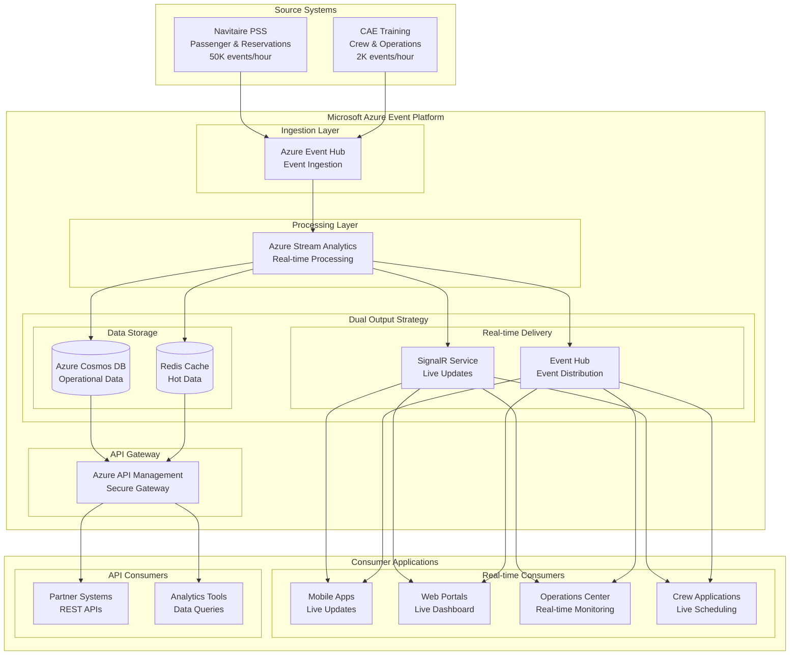

## Detailed Architecture - Navitaire PSS Integration

### Navitaire Source System Integration
```mermaid
graph TB
    subgraph "Navitaire PSS System"
        NPS[Passenger Service System]
        NRS[Reservation System]
        NIM[Inventory Management]
        NLP[Loyalty Programs]
        NRM[Revenue Management]
    end
    
    subgraph "Integration Methods"
        subgraph "Real-time APIs"
            API1[REST API Webhooks<br/>< 100ms latency]
            API2[GraphQL Subscriptions<br/>Real-time queries]
        end
        
        subgraph "Database Integration"
            CDC1[Change Data Capture<br/>SQL Server CDC]
            TRG1[Database Triggers<br/>Immediate events]
        end
        
        subgraph "Message Queues"
            MQ1[IBM MQ Integration<br/>Reliable messaging]
            MQ2[RabbitMQ Adapter<br/>Event streaming]
        end
    end
    
    subgraph "Event Types"
        subgraph "Passenger Events"
            PE1[PNR Created/Updated]
            PE2[Passenger Profile Changes]
            PE3[Special Service Requests]
        end
        
        subgraph "Booking Events"
            BE1[Reservation Created]
            BE2[Payment Processing]
            BE3[Booking Modifications]
        end
        
        subgraph "Inventory Events"
            IE1[Seat Availability]
            IE2[Fare Changes]
            IE3[Class Upgrades]
        end
        
        subgraph "Loyalty Events"
            LE1[Points Earned/Redeemed]
            LE2[Tier Status Changes]
            LE3[Promotional Offers]
        end
    end
    
    NPS --> API1
    NRS --> CDC1
    NIM --> MQ1
    NLP --> API2
    NRM --> TRG1
    
    API1 --> PE1
    API1 --> BE1
    CDC1 --> PE2
    CDC1 --> BE2
    MQ1 --> IE1
    MQ1 --> IE2
    API2 --> LE1
    TRG1 --> IE3
```

### Navitaire Event Processing Flow
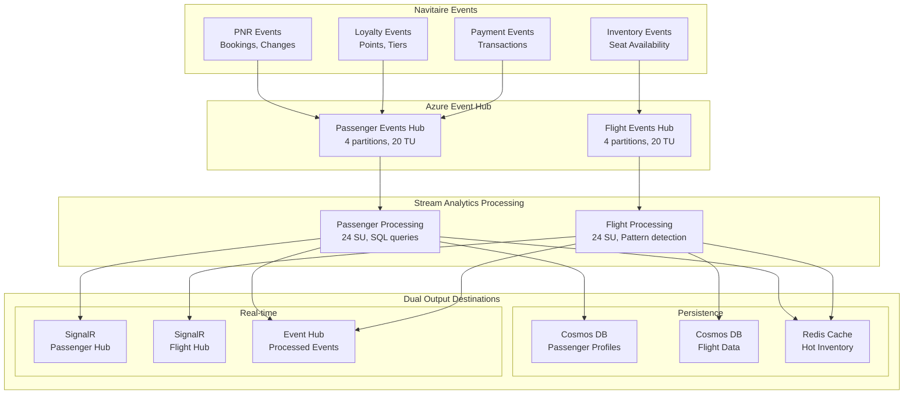

## Detailed Architecture - CAE Training Integration

### CAE Source System Integration
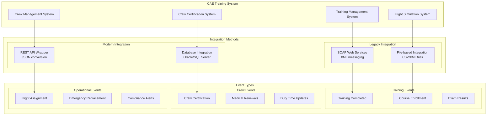

### CAE Event Processing Flow
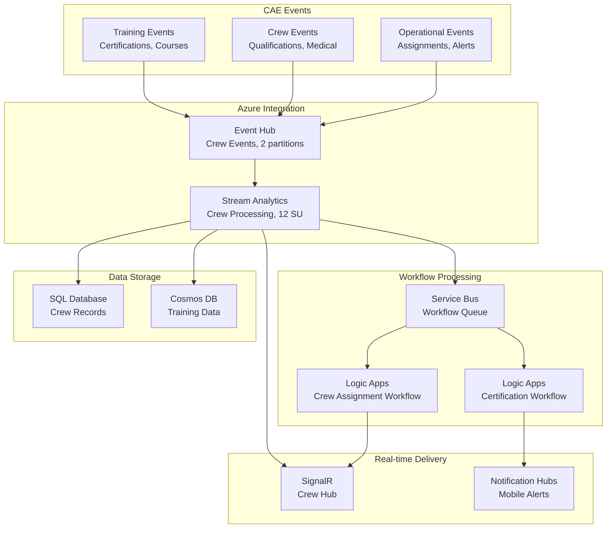

## Modular Data Flow Diagrams

### End-to-End Navitaire Booking Flow
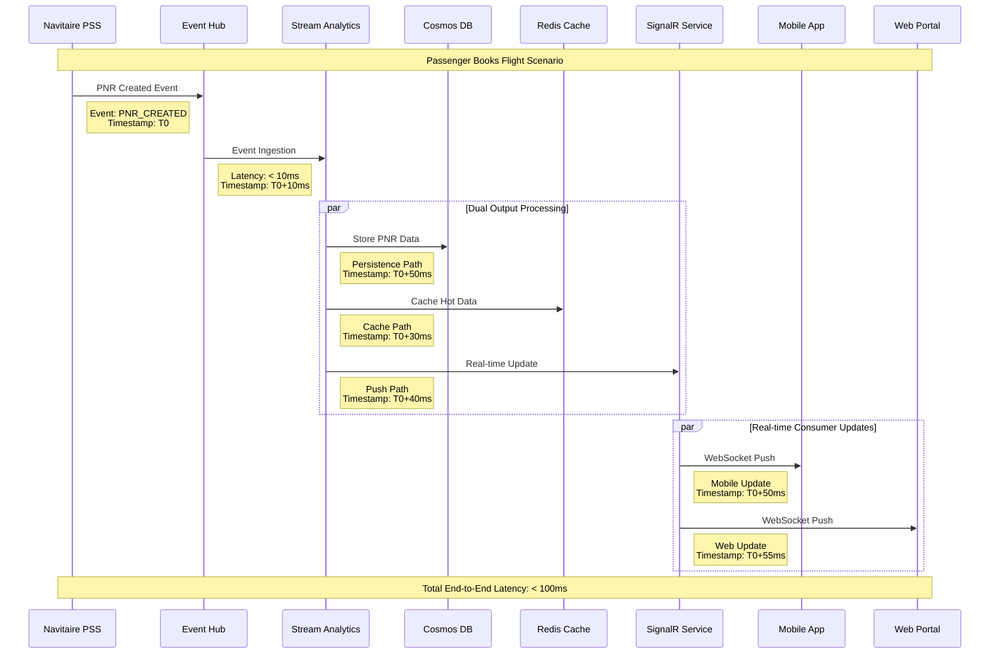

### End-to-End CAE Crew Certification Flow
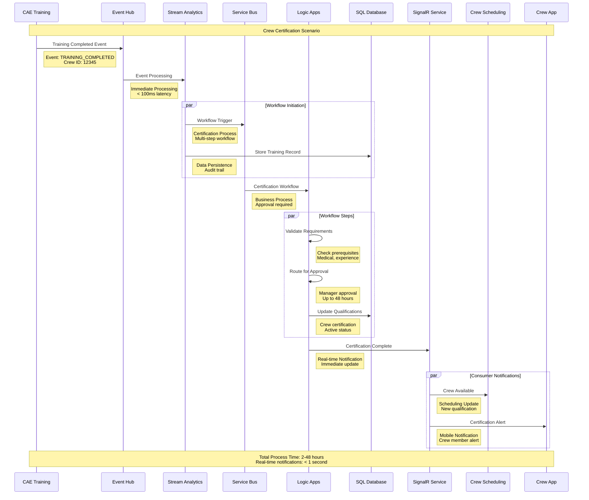

### Navitaire Inventory Update Flow
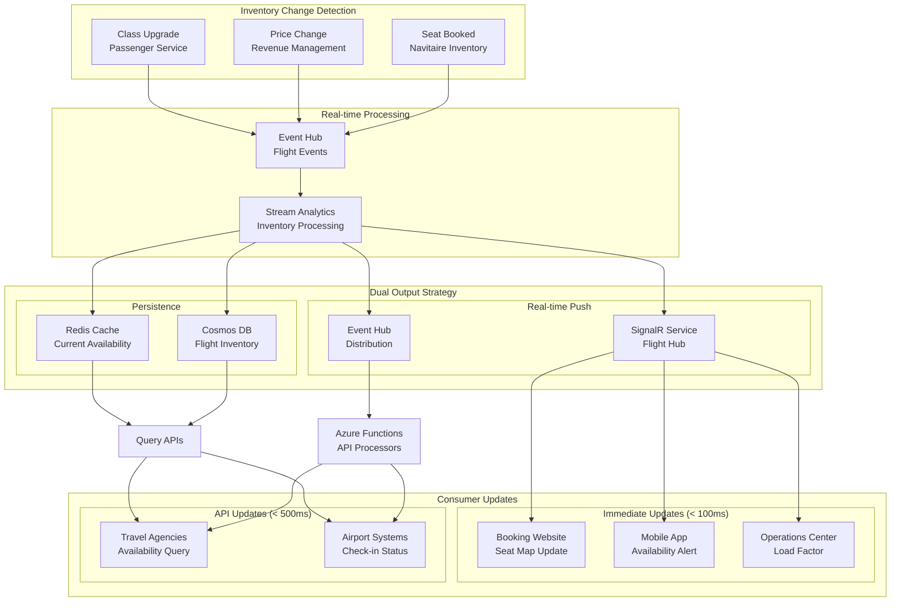

### CAE Crew Assignment Flow
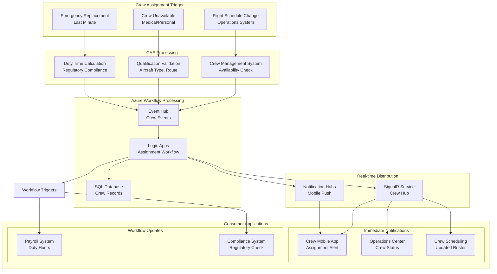

## Performance and Latency Specifications

### Navitaire Performance Targets
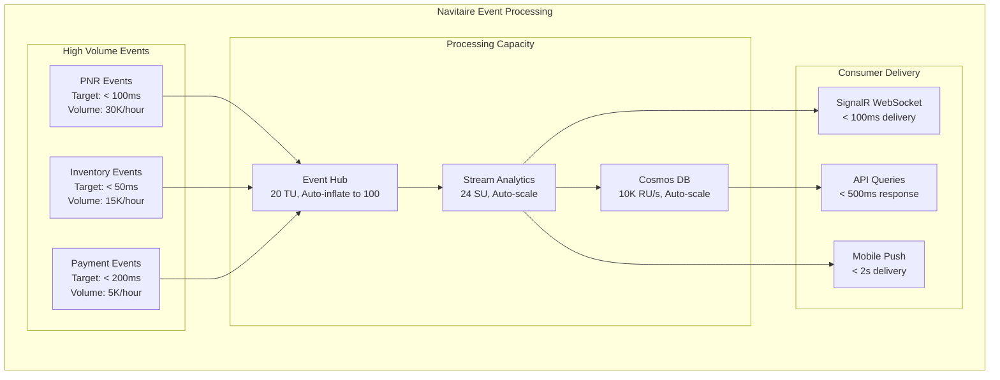

### CAE Performance Targets
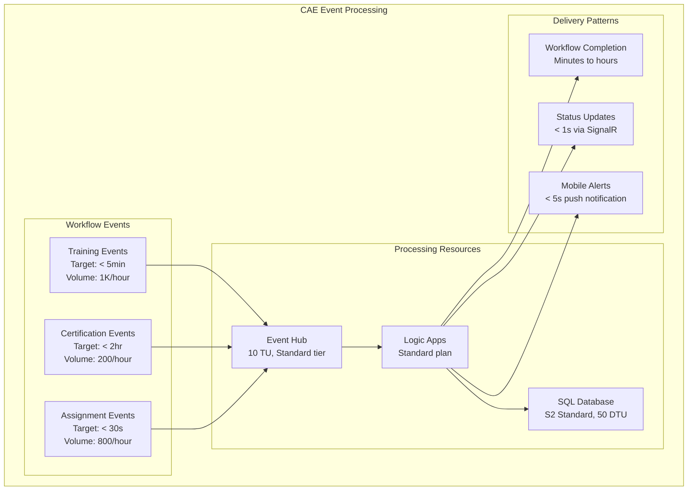

## Integration Patterns Summary

### Navitaire Integration Pattern
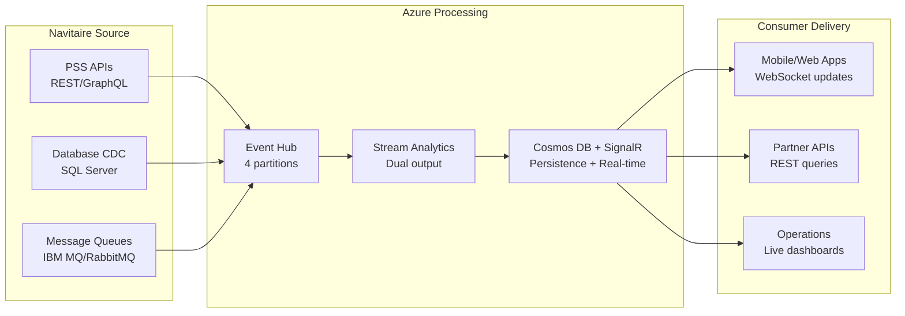

### CAE Integration Pattern
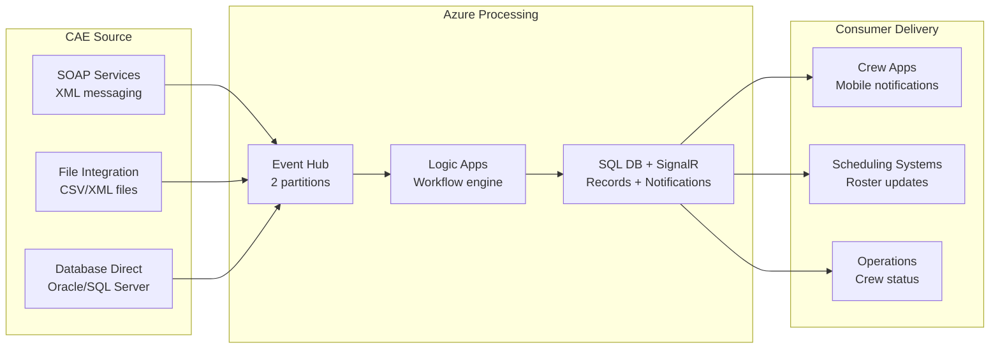
